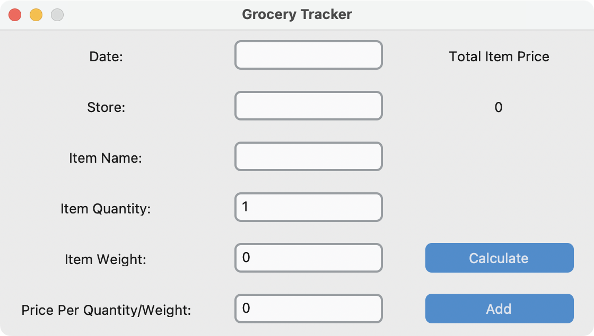

# Grocery Tracker

## About
<!-- ------------------------------------------------------- -->

This project was created as a minimalistic way to capture values into a csv file.
Specifically, this is a way to keep track of grocery purchase habits from various stores.
This project was crafted using the CustomTkinter Python package.

The User Interface (UI) consists of fields that are of primary interest to purchases.
The "Calculate" button computes the total price of the item that is going to be added to the csv file.
The "Add" button appends a row using the values from the entry fields and the calculated total item price.

